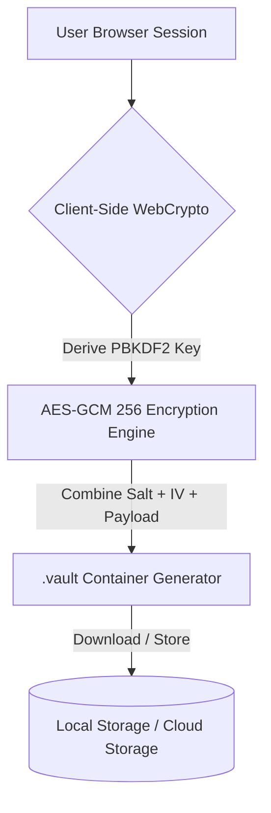

<div align="center">

  <!-- Logo / Image Placeholder -->
    

  # RedVault 256

  <p align="center">
    <b>A Multi-Media Vault & Encryption Engine.</b>
    <br />
    ·
    <a href="https://github.com/Bharathrajzero/RedVault/issues/new?template=bug_report.md">Report Bug</a>
    ·
    <a href="https://github.com/Bharathrajzero/RedVault/issues/new?template=feature_request.md">Request Feature</a>
  </p>

  <!-- Badges -->
  <p align="center">
    <a href="https://github.com/Bharathrajzero/RedVault/actions">
      
    </a>
    <a href="https://codecov.io/gh/Bharathrajzero/RedVault">
      
    </a>
    <a href="https://github.com/Bharathrajzero/RedVault/blob/main/LICENSE">
      
    </a>
    <a href="https://github.com/Bharathrajzero/RedVault/stargazers">
      
    </a>
  </p>

</div>

---

## 🔍 Overview

**RedVault 256** is a client-side cryptographic engine and live rendering vault. Built directly on top of the native browser Web Crypto API (AES-GCM 256-bit with PBKDF2 key derivation), it packages raw files, metadata, cryptographic salt, and IVs into a custom `.vault` container format—ensuring your sensitive data remains completely private and unreadable to third-party servers.

```text
+-----------------------------------------------------------------------+
|                                                                       |
|                       [ Encrypt / Decrypt Interface ]                 |
|   +-------------------+                       +-------------------+   |
|   |   Original File   | --(AES-256-GCM)-->  |  .vault Container |   |
|   +-------------------+                       +-------------------+   |
|                                                                       |
+-----------------------------------------------------------------------+

```

---
## Screenshots


---
## ✨ Key Features

| Feature | Description |
| --- | --- |
| **🛡️ Client-Side Cryptography** | Key generation (PBKDF2 SHA-256, 100,000 iterations) and encryption (AES-GCM 256-bit) occur 100% locally. |
| **📦 Custom `.vault` Container** | Bundles salt, IV, meta length, metadata JSON, and raw payload into a unified binary format. |
| **🎬 Multi-Media Live Preview** | Dynamically unpacks and renders images, audio, video, PDFs, and plain text directly in the browser upon decryption. |
| **⚡ Native Frontend Stack** | Written in zero-dependency, vanilla HTML5, CSS Variables, and JS with a lightweight Express backend server for dev/local execution. |

---

## 📁 Project Structure

```text
RedVault/
├── public/
│   └── index.html          # Main web application & user interface
├── vault_storage/          # Local backend storage directory (created at runtime)
├── server.js               # Node.js local server with Express and Multer
├── package.json            # Node.js project manifest & dependencies
├── package-lock.json       # Locked dependency tree
├── LICENSE                 # Project license
└── README.md               # Project documentation

```

---

## 📦 Container Binary Specification

When RedVault 256 generates a `.vault` container, it compiles the binary using the following layout:

```text
[ Salt: 16 Bytes ] [ IV: 12 Bytes ] [ Encrypted Ciphertext Payload ]

```

### Decrypted Internal Payload Structure

Once decrypted with the derived master key, the payload parses as:

1. **Metadata Byte Length:** 4 Bytes (`Uint32`, Little-Endian)
2. **Metadata Object:** UTF-8 Encoded JSON String (e.g., `{"name": "doc.pdf", "type": "application/pdf"}`)
3. **File Data Payload:** Raw binary bytes of the original target file

---

## 🏗️ System Architecture



---

## 🛠️ Tech Stack

* **Frontend Engine:** Vanilla JavaScript (ES6+), HTML5, Custom CSS Variables (Zero external frontend libraries)
* **Backend Dev Server:** Node.js, Express, Multer
* **Security & Cryptography:** Native Web Crypto API (`window.crypto.subtle`)
* **Data Processing:** `ArrayBuffer`, `DataView`, `Blob`, `TextEncoder` / `TextDecoder`
* **Container Format:** Encrypted custom `.vault` binary

---

## 🚀 Quick Start

### Prerequisites

* **Node.js:** Node.js v14+ installed on your machine
* **Browser:** Any modern web browser with Web Crypto API support (Chrome 37+, Firefox 34+, Safari 11+, Edge 79+)

### Installation & Local Setup

1. **Clone the Repository**

```bash
git clone [https://github.com/Bharathrajzero/RedVault.git](https://github.com/Bharathrajzero/RedVault.git)
cd RedVault

```

2. **Install Dependencies**

```bash
npm install

```

3. **Run Locally**

```bash
node server.js

```

4. **Open your browser**

```text
http://localhost:3000

```

---

## ⚙️ Configuration

RedVault 256 runs as a standalone application out of the box. No external environment variables are required for standard operation.

If hosting production builds, ensure HTTPS is enabled—the browser Web Crypto API requires a **Secure Context** (`https://` or `http://localhost`).

---

## ☁️ Future Production Upgrade: Supabase Integration

This section outlines the steps to upgrade RedVault 256 from a local file conversion tool into a secure, multi-tenant cloud vault using **Supabase** for PostgreSQL database storage, binary file storage, and authentication.

### Prerequisites

1. A **Supabase** account and project setup at [supabase.com](https://supabase.com).
2. A **Database Table** to store user-encrypted metadata records.
3. A **Supabase Storage Bucket** (e.g., named `vault-files`).

---

### Step 1: Database & Storage Bucket Setup in Supabase

Run the following SQL script inside your Supabase SQL Editor to enable Row Level Security (RLS) on user files:

```sql
-- Create table for file metadata registry
create table public.vault_files (
  id uuid default gen_random_uuid() primary key,
  user_id uuid references auth.users(id) on delete cascade not null,
  file_name text not null,
  storage_path text not null,
  file_size bigint not null,
  created_at timestamp with time zone default timezone('utc'::text, now()) not null
);

-- Enable Row Level Security (RLS)
alter table public.vault_files enable row level security;

-- Create RLS Policies
create policy "Users can view own files" on public.vault_files
  for select using (auth.uid() = user_id);

create policy "Users can insert own files" on public.vault_files
  for insert with check (auth.uid() = user_id);

create policy "Users can delete own files" on public.vault_files
  for delete using (auth.uid() = user_id);

```

#### Storage Bucket Policy Configuration

1. Go to **Storage** > **New Bucket** > Name it `vault-files`.
2. Toggle the bucket settings to **Private**.
3. Under Storage Policies, create a policy with:
* **Allowed operations:** `SELECT`, `INSERT`, `DELETE`
* **Target roles:** `authenticated`
* **Policy definition:** `(auth.uid() = (storage.foldername(name))[1]::uuid)`


---

### Step 2: Include Supabase JS SDK

Add the Supabase CDN script inside the `<head>` section of `public/index.html`:

```html
<!-- Supabase JS Client Library -->
<script src="[https://cdn.jsdelivr.net/npm/@supabase/supabase-js@2](https://cdn.jsdelivr.net/npm/@supabase/supabase-js@2)"></script>

```

Initialize the client inside the `<script>` block of `public/index.html`:

```javascript
const SUPABASE_URL = "https://YOUR_SUPABASE_PROJECT_ID.supabase.co";
const SUPABASE_ANON_KEY = "YOUR_SUPABASE_ANON_KEY";

const { createClient } = window.supabase;
const supabase = createClient(SUPABASE_URL, SUPABASE_ANON_KEY);

```

---

### Step 3: Code Modifications for Cloud Upload & Retrieval

Place these functions inside the main `<script>` tag of `public/index.html`.

#### 1. Replace Local Download with Supabase Cloud Upload

Add this function to `public/index.html` to stream the binary `.vault` blob directly to Supabase Storage instead of triggering a local browser download:

```javascript
// Location: public/index.html (inside main <script> tag)
// --- ENCRYPT & UPLOAD ENGINE ---
async function encryptAndUploadToCloud() {
  const fileInput = document.getElementById('fileInput');
  const password = document.getElementById('encryptPassword').value;
  const btnText = document.getElementById('btnEncryptText');

  // Verify User Session
  const { data: { user }, error: authErr } = await supabase.auth.getUser();
  if (!user) {
    return alert("Please log in to upload files to your cloud vault.");
  }

  if (!fileInput.files[0] || !password) {
    return alert("Please select a file and enter a password.");
  }

  btnText.innerText = "Encrypting & Uploading...";

  try {
    const file = fileInput.files[0];
    const fileBuffer = await file.arrayBuffer();

    const meta = JSON.stringify({ name: file.name, type: file.type || 'application/octet-stream' });
    const metaBytes = new TextEncoder().encode(meta);

    const payloadLength = 4 + metaBytes.byteLength + fileBuffer.byteLength;
    const combinedPayload = new Uint8Array(payloadLength);
    const view = new DataView(combinedPayload.buffer);

    view.setUint32(0, metaBytes.byteLength, true);
    combinedPayload.set(metaBytes, 4);
    combinedPayload.set(new Uint8Array(fileBuffer), 4 + metaBytes.byteLength);

    const salt = window.crypto.getRandomValues(new Uint8Array(16));
    const iv = window.crypto.getRandomValues(new Uint8Array(12));

    const key = await deriveKey(password, salt);
    const ciphertext = await window.crypto.subtle.encrypt(
      { name: "AES-GCM", iv }, key, combinedPayload
    );

    const finalVaultBuffer = new Uint8Array(salt.byteLength + iv.byteLength + ciphertext.byteLength);
    finalVaultBuffer.set(salt, 0);
    finalVaultBuffer.set(iv, 16);
    finalVaultBuffer.set(new Uint8Array(ciphertext), 28);

    const blob = new Blob([finalVaultBuffer], { type: 'application/octet-stream' });

    // 1. Upload .vault Binary Blob to Supabase Storage Bucket
    const storagePath = `${user.id}/${Date.now()}_${file.name}.vault`;
    const { data: uploadData, error: uploadError } = await supabase.storage
      .from('vault-files')
      .upload(storagePath, blob);

    if (uploadError) throw uploadError;

    // 2. Insert File Metadata Record into Supabase Database Table
    const { error: dbError } = await supabase
      .from('vault_files')
      .insert([
        {
          user_id: user.id,
          file_name: `${file.name}.vault`,
          storage_path: storagePath,
          file_size: blob.size
        }
      ]);

    if (dbError) throw dbError;

    alert("File encrypted and successfully saved to your cloud vault!");

  } catch (err) {
    console.error(err);
    alert("Cloud upload failed: " + err.message);
  } finally {
    btnText.innerText = "Encrypt & Upload to Vault";
  }
}

```

Bind this function to your encryption button in `public/index.html`:

```html
<button class="btn-primary" id="btnEncrypt" onclick="encryptAndUploadToCloud()">
  <svg viewBox="0 0 24 24"><path d="M18 8h-1V6c0-2.76-2.24-5-5-5S7 3.24 7 6v2H6c-1.1 0-2 .9-2 2v10c0 1.1.9 2 2 2h12c1.1 0 2-.9 2-2V10c0-1.1-.9-2-2-2zm-6 9c-1.1 0-2-.9-2-2s.9-2 2-2 2 .9 2 2-.9 2-2 2zm3.1-9H8.9V6c0-1.71 1.39-3.1 3.1-3.1 1.71 0 3.1 1.39 3.1 3.1v2z"/></svg>
  <span id="btnEncryptText">Encrypt & Upload to Vault</span>
</button>

```

#### 2. Fetch and Decrypt Files from Supabase Storage

Add this function to `public/index.html` to download encrypted `.vault` files from your Supabase bucket and unpack them locally into the rendering engine:

```javascript
// Location: public/index.html (inside main <script> tag)
// --- FETCH AND DECRYPT FROM SUPABASE ---
async function fetchAndDecryptFromCloud(storagePath, password) {
  try {
    // 1. Download Encrypted Payload from Supabase Storage
    const { data: blob, error } = await supabase.storage
      .from('vault-files')
      .download(storagePath);

    if (error) throw error;

    // 2. Convert Blob to ArrayBuffer
    const vaultBuffer = new Uint8Array(await blob.arrayBuffer());

    // 3. Extract Cryptographic Components
    const salt = vaultBuffer.slice(0, 16);
    const iv = vaultBuffer.slice(16, 28);
    const ciphertext = vaultBuffer.slice(28);

    // 4. Derive Key & Decrypt Payload
    const key = await deriveKey(password, salt);
    const decryptedBuffer = await window.crypto.subtle.decrypt(
      { name: "AES-GCM", iv }, key, ciphertext
    );

    // 5. Parse Metadata & Original File Binary
    const view = new DataView(decryptedBuffer);
    const metaLength = view.getUint32(0, true);
    const metaBytes = new Uint8Array(decryptedBuffer, 4, metaLength);
    const meta = JSON.parse(new TextDecoder().decode(metaBytes));

    const fileBytes = decryptedBuffer.slice(4 + metaLength);
    const fileBlob = new Blob([fileBytes], { type: meta.type });
    const fileUrl = URL.createObjectURL(fileBlob);

    // Render preview using existing application renderer
    renderPreview(meta, fileBlob, fileUrl);

  } catch (err) {
    console.error(err);
    alert("Decryption failed! Incorrect password or file retrieval error.");
  }
}

```

Trigger this function whenever a user selects a file item from their saved cloud vault list in the UI:

```javascript
// Example UI event listener for a cloud file item
document.querySelectorAll('.vault-item').forEach(item => {
  item.addEventListener('click', (e) => {
    const path = e.currentTarget.dataset.storagePath;
    const pass = prompt("Enter your master password to unlock file:");
    if (pass) fetchAndDecryptFromCloud(path, pass);
  });
});

```

---

## 🛣️ Roadmap

* [x] Client-side AES-GCM 256-bit PBKDF2 encryption engine
* [x] Multi-media browser preview renderer (Image, Video, Audio, Text, PDF)
* [x] Custom `.vault` binary file specification
* [ ] Supabase Cloud Storage & Auth Integration
* [ ] Asynchronous chunk-based processing for large files (> 500MB)
* [ ] Multi-recipient public key encryption (WebAuthn / RSA-OAEP integration)

See open issues at [Issues](https://github.com/Bharathrajzero/RedVault/issues) for proposed features and updates.

---

## 🤝 Contributing

We welcome contributions! Please review our guidelines before submitting pull requests:

1. Fork the Repository.
2. Create your Feature Branch (`git checkout -b feature/AmazingFeature`).
3. Commit your Changes (`git commit -m 'feat: Add amazing new feature'`).
4. Push to the Branch (`git push origin feature/AmazingFeature`).
5. Open a Pull Request.

---

## 📄 License & Author

* **License:** This project is licensed under the MIT License © 2026 Bharath Raj, AlphaGroup.
* **Developer:** Bharath Raj
* **Year:** 2026
